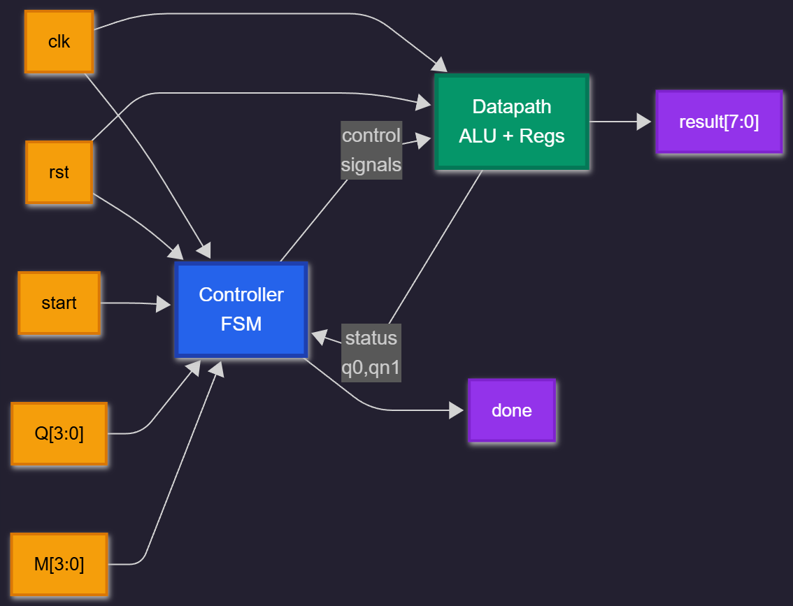

# 4-bit Booth Multiplier

A hardware implementation of Booth's multiplication algorithm in Verilog HDL using datapath-controller architecture.

## Overview

This project implements Booth's algorithm for signed binary multiplication. Instead of repeated addition, Booth's algorithm examines pairs of bits to decide whether to add, subtract, or shift - making it efficient for both positive and negative numbers in 2's complement format.

**Key Features:**
- Handles signed 4-bit multiplication (produces 8-bit result)
- FSM-based controller with 7 states
- Separate datapath and control logic
- Works with 2's complement arithmetic

## Architecture

The design follows a classic datapath-controller separation:



## Quick Start

### Prerequisites
- Icarus Verilog (iverilog)
- GTKWave (for viewing waveforms)

### Running Simulation
```bash
# Compile
iverilog -o booth datapath.v controller.v topmodule.v tb.v

# Run
vvp booth

# View waveform
gtkwave wave.vcd
```

## Test Results

| Inputs (Q × M) | Decimal | Output | Decimal |
|----------------|---------|--------|---------|
| 0011 × 0011 | 3 × 3 | 00001001 | 9 |
| 0011 × 1010 | 3 × (-6) | 11101110 | -18 |
| 1101 × 1110 | (-3) × (-2) | 00000110 | 6 |

### Waveform Output

*Example: 3 × 3 = 9 shown in hex (0x09)*

## What I Learned

- **FSM Design**: Implementing state machines for sequential control logic
- **Digital Design**: Separating datapath from controller
- **2's Complement**: How signed arithmetic works at the hardware level
- **Verilog**: Writing synthesizable RTL code with proper timing

## Challenges & Solutions

**Problem**: Controller kept restarting after completion  
**Solution**: Modified FSM to wait for start signal to go low in DONE state before returning to IDLE

**Problem**: Incorrect results due to number format  
**Solution**: Used proper Verilog notation (`4'b0011` instead of `0011` to avoid octal interpretation)

## Design Decisions

- **4-bit operands**: Kept small for easier verification and understanding of the algorithm
- **Synchronous design**: All operations triggered on clock edges for predictable timing
- **Status signals from datapath**: Controller reads Q[0] and Qn1 from datapath rather than tracking internally - maintains single source of truth

## Future Enhancements

- [ ] Scale to 8-bit or 16-bit multiplication
- [ ] Add pipelining for higher throughput
- [ ] Implement Wallace tree multiplier for comparison
- [ ] Synthesize and test on FPGA hardware

## File Structure
```
├── datapath.v      # Arithmetic operations and registers
├── controller.v    # FSM control logic
├── topmodule.v     # Top-level integration
└── tb.v           # Testbench
```

## Module Interface

### Inputs
- `clk` - Clock signal
- `rst` - Active high reset
- `start` - Start signal (pulse for one cycle)
- `Q[3:0]` - Multiplier
- `M[3:0]` - Multiplicand

### Outputs
- `result[7:0]` - Product
- `done_top` - Completion flag

---

Built as a learning project to understand hardware multiplication and FSM-based controller design.