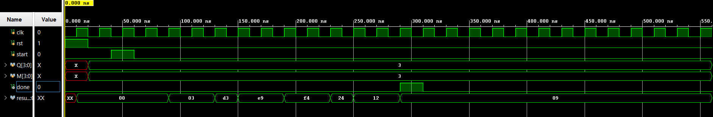

# 4-bit Booth Multiplier

A hardware implementation of Booth's multiplication algorithm using Verilog HDL, designed with separate datapath and controller modules.

## Booth's Algorithm

Booth's algorithm is an efficient method for multiplying signed binary numbers. Instead of doing repeated addition, it looks at pairs of bits and decides whether to add, subtract, or just shift. This makes it faster and works naturally with negative numbers in 2's complement format.

## Module Descriptions

### Datapath (`datapath.v`)
Handles all the data operations:
- **Registers**: ACC (accumulator), Q (multiplier), M (multiplicand), Qn1 (previous LSB)
- **Operations**: Add M to ACC, Subtract M from ACC, Arithmetic right shift
- **Outputs**: 8-bit result and status bits (q0, qn1) for controller decisions

### Controller (`controller.v`)
FSM-based controller with 7 states:
- **IDLE**: Wait for start signal
- **LOAD**: Load input values into datapath
- **CHECK**: Examine {Q[0], Qn1} to decide next action
- **ADD**: Add multiplicand to accumulator
- **SUB**: Subtract multiplicand from accumulator
- **SHIFT**: Perform arithmetic right shift
- **DONE**: Multiplication complete

The controller runs for exactly 4 iterations (for 4-bit inputs) and generates control signals based on Booth's algorithm rules.

### Top Module (`topmodule.v`)
Connects everything together. Takes two 4-bit inputs and produces an 8-bit result.

## How to Use

### Inputs
- `clk` - Clock signal
- `rst` - Active high reset
- `start` - Pulse high for one cycle to begin multiplication
- `Q[3:0]` - First operand (multiplier)
- `M[3:0]` - Second operand (multiplicand)

### Outputs
- `result[7:0]` - 8-bit product
- `done_top` - Goes high when multiplication is complete

### Running a Simulation

1. Compile all Verilog files in order:
```bash
   iverilog -o booth datapath.v controller.v topmodule.v tb.v
```

2. Run the simulation:
```bash
   vvp booth
```

3. View waveforms:
```bash
   gtkwave wave.vcd
```

## Example Test Cases

### Positive × Positive
```verilog
Q = 4'b0011 (3)
M = 4'b0011 (3)
Result = 8'b00001001 (9)
```

### Positive × Negative
```verilog
Q = 4'b0011 (3)
M = 4'b1010 (-6)
Result = 8'b11101110 (-18 in hex: 0xEE)
```

### Negative × Negative
```verilog
Q = 4'b1101 (-3)
M = 4'b1110 (-2)
Result = 8'b00000110 (6)
```

## Important Notes

- Numbers are in **2's complement** format (signed)
- The `start` signal must pulse for **only one clock cycle**
- Result appears in hex format in most waveform viewers
- Takes 4 clock cycles after start to complete

## Booth's Algorithm Rules

Based on bits {Q[0], Qn1}:
- `00` or `11` → Just shift right
- `10` → Subtract M from ACC, then shift
- `01` → Add M to ACC, then shift

Repeat for n iterations (4 times for 4-bit numbers).

## Waveform

- Inputs : M = 0011 (3) , Q = 0011 (3)